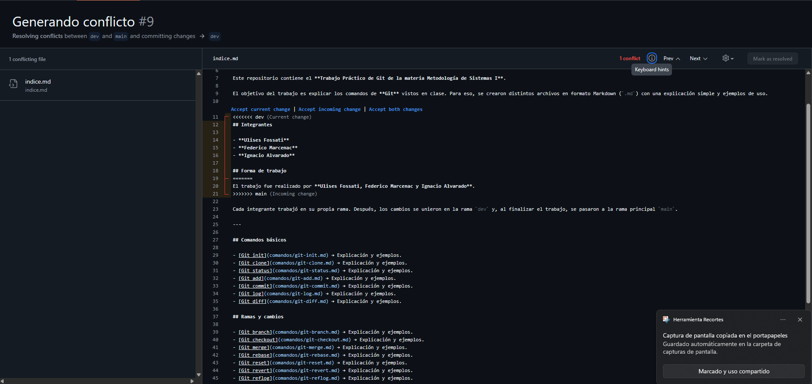

# Estadísticas del repositorio

1. Integrante con más commits: **Ulises Fossati, con 14 commits**

Comando:

```bash
git shortlog -sn --all
```

Resultado:

```text
12  nachoalvarado78
11  Ulises Fossati
9   Federico Marcenac
4   FedericoMarcenac
3   ulisesfossati
```

Algunos integrantes aparecen con dos nombres distintos por la configuración de Git.

Sumando los nombres correspondientes a cada integrante:

```text
14  Ulises Fossati
13  Federico Marcenac
12  Ignacio Alvarado
```

2. Cantidad total de merges: **11**

Comando:

```bash
git rev-list --merges --count --all
```

Para ver la lista de merges:

```bash
git log --oneline --merges --all
```

3. Cantidad de ramas: **9**

Son las ramas reales del repositorio en GitHub. Se excluye el puntero `origin/HEAD`, ya que no es una rama.

Comando:

```bash
git branch -r
```

Ramas:

```text
origin/dev
origin/feat/git-stash
origin/fede
origin/fix/corregir-palabra
origin/main
origin/nacho
origin/rama_conflicto1
origin/style/formato-indice
origin/ulises
```

4. Cantidad de conflictos: **1**

La captura del conflicto antes de resolverlo se encuentra en:

```text
imagenes/conflicto.png
```

El hash relacionado con el conflicto se encuentra en:

```text
imagenes/hash del conflicto.txt
```



5. Commit con más archivos modificados: **20**

```text
b72a766 Merge pull request #6 from ulisesfossati/fix/corregir-palabra
```

Comando utilizado para revisar los commits:

```bash
git log --stat --oneline --all
```

Comando utilizado para encontrar el commit con más archivos modificados:

```bash
git rev-list --all | while read commit; do
  cantidad=$(git diff-tree --no-commit-id --name-only -r -m "$commit" | sort -u | wc -l | tr -d ' ')
  mensaje=$(git log -1 --pretty=%s "$commit")
  echo "$cantidad $commit $mensaje"
done | sort -nr | head -10
```

Comando para ver el commit:

```bash
git show -m b72a7664648533f592258b73c125740d940c176b
```

La captura del diff se encuentra en:

```text
imagenes/diff-commit.png
```


### [Volver al índice](indice.md)
